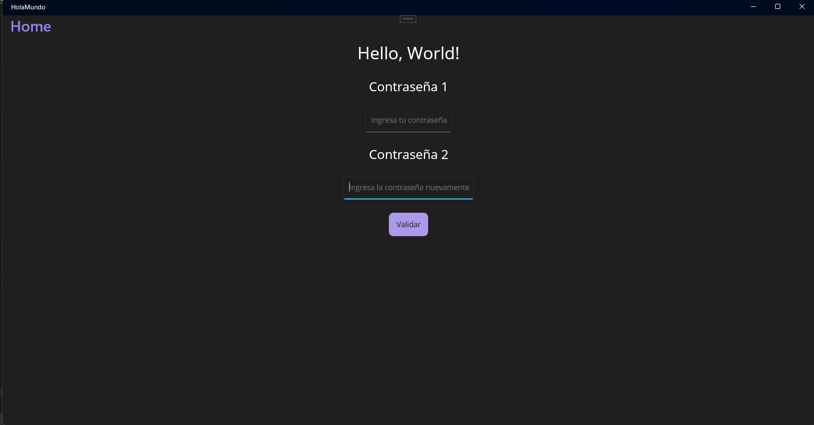
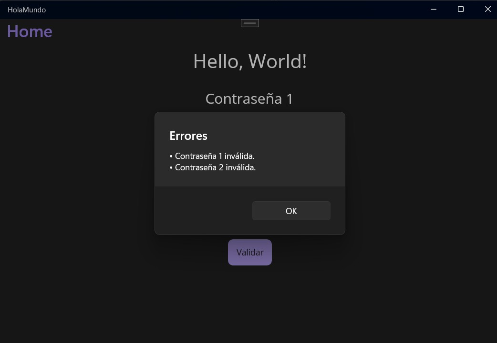
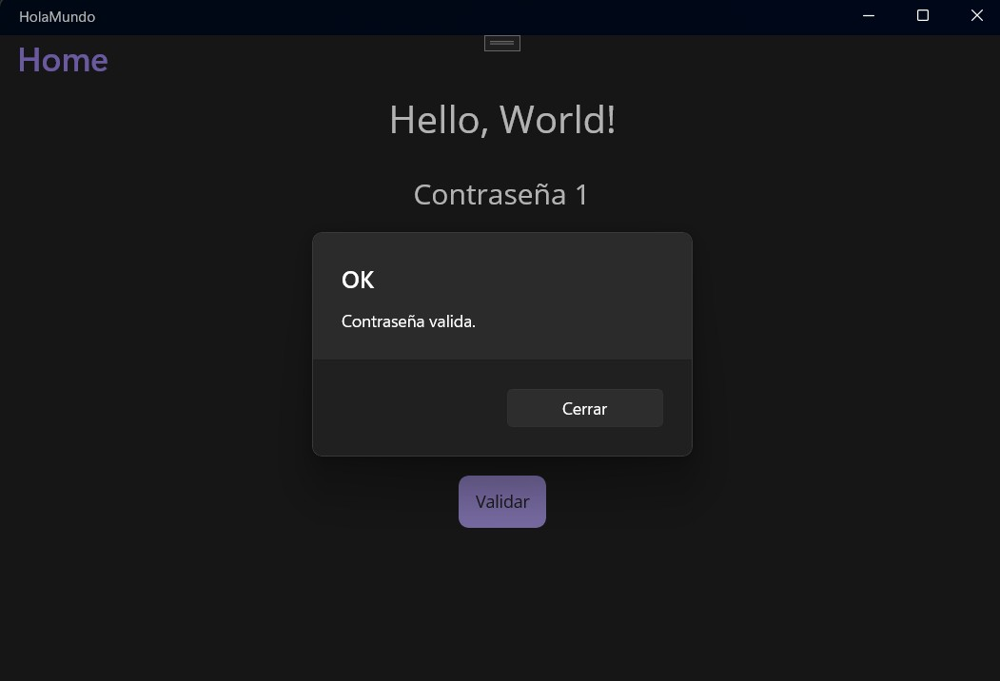

# HolaMundo - Validador de Contraseñas en .NET MAUI

Aplicación sencilla hecha en **.NET MAUI** para validar contraseñas ingresadas en dos campos de texto.  
La app verifica que las contraseñas cumplan con los siguientes requisitos:

- Al menos una letra mayúscula.
- Al menos una letra minúscula.
- Al menos un número.
- Al menos un símbolo.
- Que ambas contraseñas coincidan.

Pantalla principal al ejecutar el proyecto

Al introducir alguna contraseña mal , nos aparecera un mensaje con el input que tenga el error

Cuando se ingrese la contraseña con las especificaciones correctas y sean iguales aparecera el mensaje de exito

---

## 📂 Estructura

- **MainPage.xaml**: Interfaz gráfica con los `Entry` para ingresar contraseñas y el botón *Validar*.
- **MainPage.xaml.cs**: Lógica de validación con expresiones regulares.

---
- Maestria en Computo aplicado
- CiberInfraestructura
- José de Jesús Rodríguez Hernándenz
---

